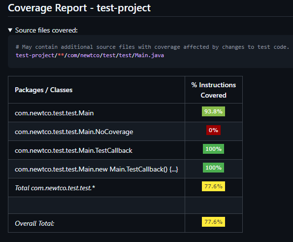
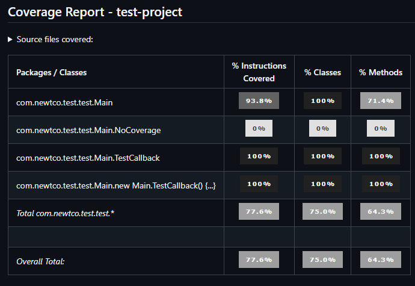
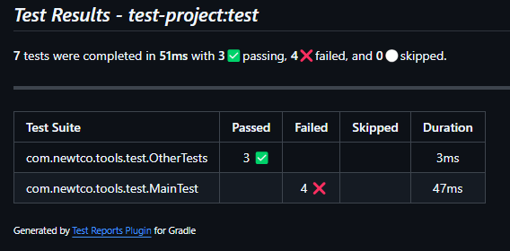
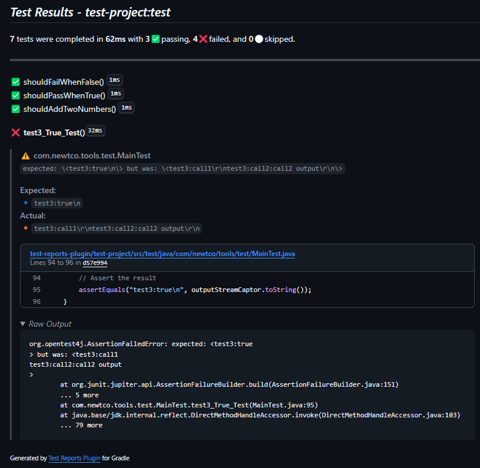

# test-reports-plugin for Gradle

A Gradle plugin to add JSON and Markdown reports to JaCoCo and JUnit test tasks.

## Sample Reports

### 1. Coverage: Summary Report
>   
> \* <sub>green-red color scheme</sub>

### 2. Coverage: Detailed Report
>   
> \* <sub>monochrome color scheme</sub>

### 3. Coverage: JSON report
<details>

##### Using simple counters:
```json
{
    "report": {
        "name": "test-project",
        "counters": {
            "instruction": 77.59,
            "branch": 100.0,
            "line": 70.83,
            "complexity": 66.67,
            "class": 75.0,
            "method": 64.29
        },
        "packages": [
            {
                "name": "com.newtco.test.test",
                "counters": {
                    "instruction": 77.59,
                    "branch": 100.0,
                    "line": 70.83,
                    "complexity": 66.67,
                    "class": 75.0,
                    "method": 64.29
                },
                "classes": [
                    {
                        "name": "Main.TestCallback",
                        "sourceFile": "Main.java",
                        "counters": {
                            "instruction": 100.0,
                            "branch": 0,
                            "line": 100.0,
                            "complexity": 100.0,
                            "class": 100.0,
                            "method": 100.0
                        },
                        "methods": [
                            {
                                "name": "<init>",
                                "signature": "Main.TestCallback()",
                                "line": {
                                    "first": 62,
                                    "last": 62
                                },
                                "counters": {
                                    "instruction": 100.0,
                                    "branch": 0,
                                    "line": 100.0,
                                    "complexity": 100.0,
                                    "class": 0,
                                    "method": 100.0
                                }
                            }
                        ]
                    },
                    {
                        "name": "Main",
                        "sourceFile": "Main.java",
                        "counters": {
                            "instruction": 93.75,
                            "branch": 100.0,
                            "line": 85.71,
                            "complexity": 75.0,
                            "class": 100.0,
                            "method": 71.43
                        },
                        "methods": [
                            {
                                "name": "<init>",
                                "signature": "Main()",
                                "line": {
                                    "first": 19,
                                    "last": 19
                                },
                                "counters": {
                                    "instruction": 100.0,
                                    "branch": 0,
                                    "line": 100.0,
                                    "complexity": 100.0,
                                    "class": 0,
                                    "method": 100.0
                                }
                            },
                            {
                                "name": "test1",
                                "signature": "test1()",
                                "line": {
                                    "first": 22,
                                    "last": 23
                                },
                                "counters": {
                                    "instruction": 100.0,
                                    "branch": 0,
                                    "line": 100.0,
                                    "complexity": 100.0,
                                    "class": 0,
                                    "method": 100.0
                                }
                            }
                        ]
                    },
                    {
                        "name": "Main.new Main.TestCallback() {...}",
                        "sourceFile": "Main.java",
                        "counters": {
                            "instruction": 100.0,
                            "branch": 0,
                            "line": 100.0,
                            "complexity": 100.0,
                            "class": 100.0,
                            "method": 100.0
                        },
                        "methods": [
                            {
                                "name": "call1",
                                "signature": "call1()",
                                "line": {
                                    "first": 35,
                                    "last": 36
                                },
                                "counters": {
                                    "instruction": 100.0,
                                    "branch": 0,
                                    "line": 100.0,
                                    "complexity": 100.0,
                                    "class": 0,
                                    "method": 100.0
                                }
                            }
                        ]
                    }
                ],
                "sourceFiles": [
                    {
                        "name": "Main.java",
                        "counters": {
                            "instruction": 77.59,
                            "branch": 100.0,
                            "line": 70.83,
                            "complexity": 66.67,
                            "class": 75.0,
                            "method": 64.29
                        },
                        "lines": [
                            {
                                "number": 19,
                                "instructions": 100.0,
                                "branches": 0
                            },
                            {
                                "number": 22,
                                "instructions": 100.0,
                                "branches": 0
                            }
                        ]
                    }
                ]
            }
        ]
    }
}
```

##### Using full counters:

```json
{
    "report": {
        "name": "test-project",
        "counters": {
            "instruction": {
                "covered": 45,
                "missed": 13
            },
            "branch": {
                "covered": 2,
                "missed": 0
            },
            "line": {
                "covered": 17,
                "missed": 7
            },
            "complexity": {
                "covered": 10,
                "missed": 5
            },
            "class": {
                "covered": 3,
                "missed": 1
            },
            "method": {
                "covered": 9,
                "missed": 5
            }
        }
    }
}
```

</details>

---

### 4. JUnit Summary Report:
> 

### 5. JUnit Detailed Report:
> 

### 6. JUnit JSON report


## Getting Started

### Applying the Plugin

To apply the plugin, add the following to your `build.gradle` file:

```groovy
plugins {
    id 'com.newtco.test.test-reports-plugin' version '1.0.0'
}
```

Alternatively, if you are using the legacy plugin application method, you can use:

```groovy
buildscript {
    repositories {
        gradlePluginPortal()
    }
    dependencies {
        classpath 'com.newtco.test.test-reports-plugin:1.0.0'
    }
}

apply plugin: 'com.newtco.test.test-reports-plugin'
```

## Configuration

JSON reports are generated by the plugin directly in code and do not support any customization beyond the few
properties documented below.

Markdown reports are based on simple templates which compile to Java code. The plugin will create a new SourceSet named
`test-reports` and copy the default templates for both coverage and tests output to subdirectories of the SourceSet.
You can modify these templates if required. The templates are shared by all test tasks.

A single task for transpiling the templates to Java classes is created. This task allows you to change the package name
of generated templates.

### _ProcessReportTemplates Task:_

_Groovy DSL:_

```groovy
tasks.named("processReportTemplates").configure {
    templatePackage = "com.newtco.test.report.templates"
}
```

_Kotlin DSL:_

```kotlin
tasks.named("processReportTemplates").configure {
    setProperty("templatePackage", "com.newtco.test.report.templates")
}
```

### Configuring JUnit test report output

Both JSON and Markdown reports are configured as extensions of the existing `Test` and `JacocoReport` tasks.

### Configuring Test tasks reports:

#### _Groovy DSL:_

```groovy
tasks.withType(Test).configureEach {
    
    additionalReports {
        // Stack filters allow you to include/exclude certain classes from the stack traces
        // of test failure outputs in a report. This greatly reduces the size of stack traces
        // in report outputs.
        stackFilters {
            include(
               // Default is to include project classes
               "${project.group}.**"
            )
        }

        // Three properties control how reports attempt to generate GitHub/GitLab permalinks to the 
        // failing line of a test case.
        //
        // Owner/repository associated with the report output.
        //
        // Default Value: GITHUB_REPOSITORY or CI_PROJECT_PATH_SLUG environment variable.
        gitLinkRepository = "newty-coffee/test-reports-plugin"
        //
        // Commit ID associated with the report.
        //
        // Default Value: GITHUB_SHA or CI_COMMIT_SHA environment variable
        gitLinkCommit = System.getenv("GITHUB_SHA")
        //
        // URL template used for generating links to the source code files in the report.
        // Supported template replacement parameters:
        //  repository - maps to gitLinkRepository property
        //  commit     - maps to gitLinkCommit property
        //  file       - maps to source code file path relative to the git repo root
        //
        // Default value: https://github.com/{repository}/blob/{commit}/{file} or
        //                https://gitlab.com/{repository}/blob/{commit}/{file} 
        gitLinkUrlTemplate = "https://github.com/{repository}/blob/{commit}/{file}"

        // JSON configuration
        json {
            enabled = true
            // Merge all JSON reports into a single .json file
            aggregateReports = false
            // Include the system err logs in the reports
            includeSystemErrLog = true
            // Include the system out logs in the reports
            includeSystemOutLog = true
            // Whether to associate err/out logs with test cases or test suites
            outputPerTestCase = true

            // Only capture specific test outcomes
            testOutcomes("passed", "failed", "skipped")
        }

        // Summary markdown report configuration
        summaryMarkdown {
            enabled = true    
            // Merge all summary reports into a single .md file
            aggregateReports = true
        }

        // Detailed markdown report configuration
        detailedMarkdown {
            enabled = true
            // Merge all detailed reports into a single .md file
            aggregateReports = false
             
            // Same as for JSON configuration
            includeSystemErrLog = true
            includeSystemOutLog = true
            outputPerTestCase = true

            // Limit output to only failed and skipped tests
            testOutcomes("failure", "skipped")
        }
    }
    
    // Alternatively, configure the extension type
    extensions.getByType(com.newtco.test.reports.plugin.test.TestReportsExtension).configure {
        // Same as additionalReports above
    }

}
```

#### _Kotlin DSL:_

```kotlin
tasks.withType<Test> {
    additionalReports {
        // Same as Groovy DSL
    }
    
    // Alternatively, configure the extension type (without the use of getByType())
    extensions.configure(com.newtco.test.reports.plugin.test.TestReportsExtension::class) {
        // Same as Groovy DSL
    }
}
```

### Configuring Jacoco task reports:

#### _Groovy DSL:_

```groovy
tasks.withType(JacocoReport).configureEach {
    additionalReports {
        // Sets the git ref name used as the base ref to generate a list of files changed. If
        // the plugin is able to generate a list of files which have changed, it will limit 
        // report output to only those files. The plugin will also detect the dependencies of
        // any test and add those as well. This allows capturing coverage changes when only 
        // tests are modified.
        // The plugin will run the following command to generate the list:
        // git --no-pager diff --name-only {gitBaseRef} HEAD -- {project.name}/**/*.java
        //
        // Default value: GITHUB_BASE_REF or CI_MERGE_REQUEST_TARGET_BRANCH_NAME environment
        // variable
        gitBaseRef = "develop"

        // List of Java source files to include or exclude in the coverage report. The plugin
        // will add files to this list if it can detect files changed via the gitBaseRef 
        // property.
        changeSet {
            // Exclude Test files
            exclude "**/*Test.java"
        }

        // JSON configuration
        json {
            enabled = true
            // Whether to include line coverage information in the report
            includeLines = false
            // Whether to include method coverage information in the report
            includeMethods = false
            // Whether to include class coverage information in the report
            includeClasses = true
            // Whether to include source coverage information in the report
            includeSources = false
            // Whether to simplify counters as a percentage or an object containing covered 
            // and missed properties
            simplifiedCounters = true
        }

        // Summary markdown report configuration
        summaryMarkdown {
            enabled = true
            // The shields.io badge style for coverage amounts in the report
            badgeStyle = "flat-square"
            // The color scheme used for coverage badges. 3 color schemes exist: 
            //  - green-red, monochrome, blue-red
            colorScheme = "green-red"
            // Whether to abbreviate package names in the report
            abbreviatePackages = true
        }

        // Detailed markdown report configuration. Same as summaryMarkdown configuration
        detailedMarkdown {
            enabled = true
            badgeStyle = "flat-square"
            abbreviatePackages = false
        }
    }

    // Alternatively, configure the extension type
    extensions.getByType(com.newtco.test.reports.plugin.coverage.CoverageReportsExtension)
    .configure {
        // Same as additionalReports above
    }
}
```

#### _Kotlin DSL:_

```kotlin

tasks.withType<JacocoReport> {
    additionalReports {
        // Same as Groovy DSL
    }

    // Alternatively, configure the extension type (without the use of getByType())
    extensions.configure(com.newtco.test.reports.plugin.coverage.CoverageReportsExtension::class) {
        // Same as Groovy DSL
    }
}
```

## Common Issues:

> My template changes won't compile.
>
> 1. Review the generated Java class under the build/generated/sources/reportTemplates directory. The template API is
     very basic and not documented. It basically supports 3 things: `import` statements, `text output`, and
     `code blocks`.
> 2. If you're still stuck, delete the template from the `src` directory and the plugin will re-copy the default.

## Contributing

If you would like to contribute to the plugin, please follow the guidelines below:

1. Fork the repository.
2. Create a new branch (`git checkout -b feature/your-feature`).
3. Make your changes and commit them (`git commit -am 'Add new feature'`).
4. Push to the branch (`git push origin feature/your-feature`).
5. Create a new Pull Request.

## License

This project is licensed under the Apache License, Version 2.0 - see the [LICENSE](LICENSE) file for details.